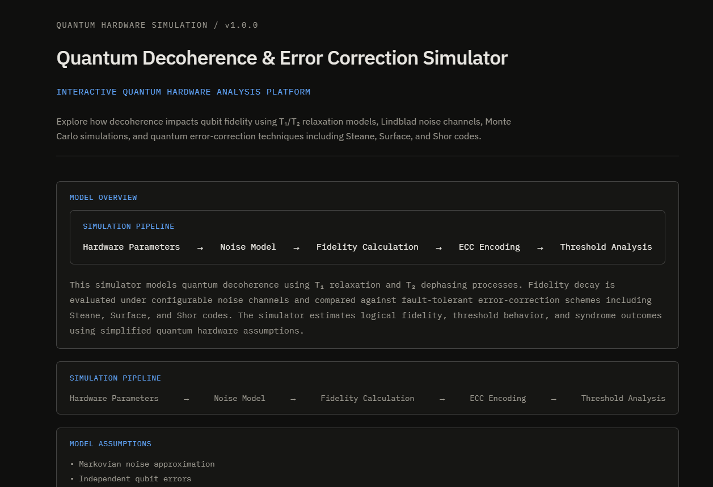
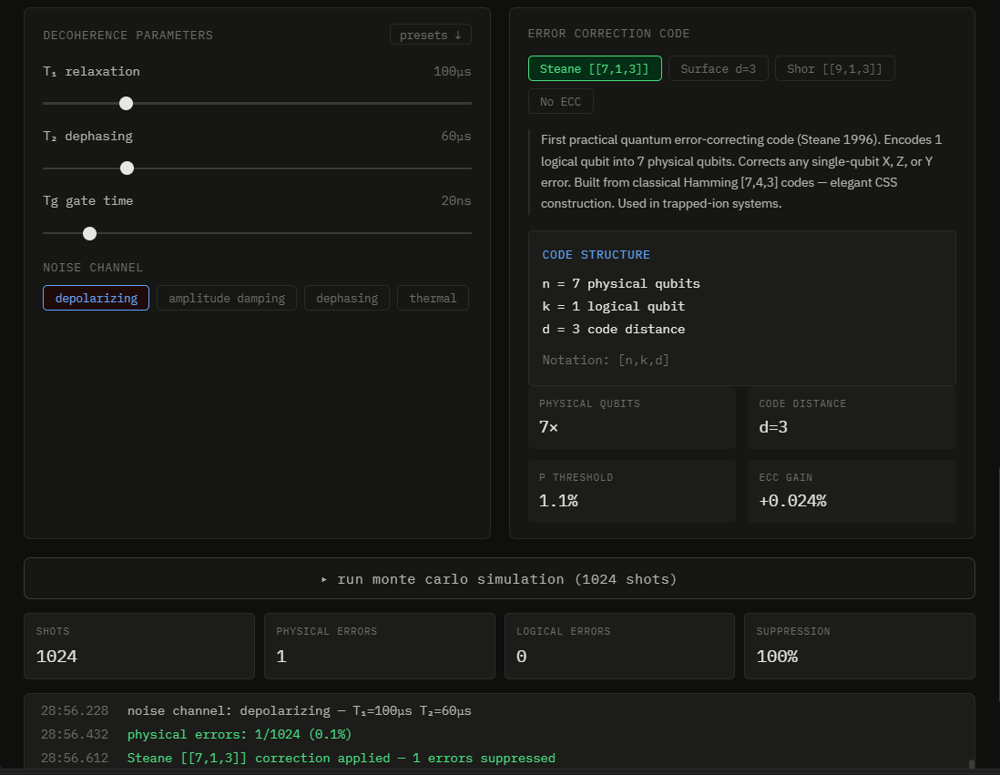
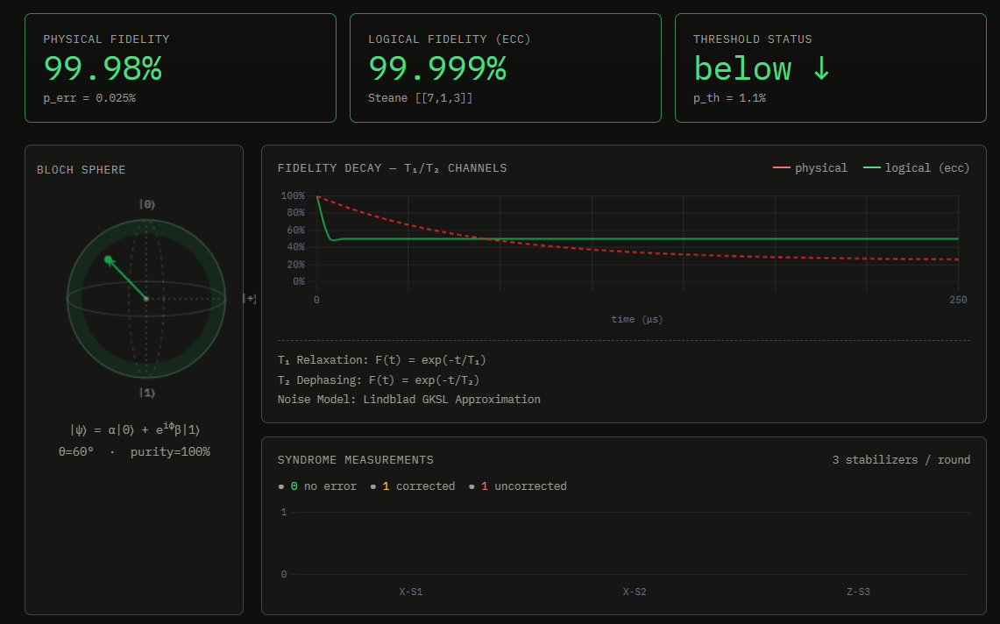

# qdecohere

A hardware-accurate quantum decoherence and error correction simulator. Built to understand the actual bottleneck in quantum computing — not gate logic, but noise.

## Screenshots

### Dashboard Overview

Shows the simulator architecture, hardware presets, threshold analysis, and fidelity metrics.



---

### Decoherence Parameters & Error-Correction Controls

Interactive control panel for T₁ relaxation, T₂ dephasing, gate time, noise channels, and quantum error-correction schemes.



---

### Quantum State Evolution & Fidelity Analysis

Bloch sphere visualization, fidelity decay curves, syndrome measurements, Monte Carlo simulation results, and logical vs physical qubit performance.



**[Live demo →](https://quantum-decoherence-simulator-ybad6dj39.vercel.app)**

---

## What this actually simulates

Real quantum computers (IBM, Google, IonQ) don't fail because quantum algorithms are wrong. They fail because qubits are physically fragile. Two timescales govern how fast a qubit dies:

**T₁ — longitudinal relaxation.** The qubit leaks energy to the environment and falls from |1⟩ to |0⟩. Think of it as a spinning top slowly falling over. On IBM's Eagle processor, T₁ ≈ 300μs. On early NISQ devices from 2019, it was closer to 15μs.

**T₂ — transverse relaxation (dephasing).** The quantum phase between |0⟩ and |1⟩ scrambles, destroying the superposition even if no energy was lost. Always T₂ ≤ 2T₁ (physical constraint from the Lindblad master equation). This is usually the harder limit.

The fidelity formulas come from the GKSL (Gorini-Kossakowski-Sudarshan-Lindblad) formalism — the correct quantum mechanical treatment of open system dynamics. Each noise channel has a different Kraus operator decomposition:

| Channel | Kraus operators | Physical meaning |
|---|---|---|
| Depolarizing | {√(1-3p/4)I, √(p/4)X, √(p/4)Y, √(p/4)Z} | Equal probability of any error |
| Amplitude damping | K₀=diag(1,√(1-γ)), K₁=√γ\|0⟩⟨1\| | Energy decay \|1⟩→\|0⟩, γ=1-e^(-t/T₁) |
| Dephasing | {√((1+p)/2)I, √((1-p)/2)Z} | Phase scrambling, no energy loss |
| Thermal | Generalized amplitude damping at T>0 | Finite-temperature environment |

---

## Error correction and the threshold theorem

Quantum error correction (QEC) is the field's answer to decoherence. The core idea: instead of fighting noise directly, encode one *logical* qubit across many *physical* qubits, then measure error syndromes without collapsing the quantum state.

The **threshold theorem** (Knill, Laflamme, Zurek 1998) says:

> If the physical error rate p is below a code-specific threshold p_th, then adding more correction layers suppresses the logical error rate **exponentially**. If p > p_th, ECC makes things worse.

This simulator demonstrates that threshold effect directly. Drag T₂ down until p > p_th and watch the correction diverge.

Three codes are implemented:

### Steane [[7,1,3]] CSS code
7 physical qubits → 1 logical qubit. Built from the classical Hamming [7,4,3] code via the CSS construction (Calderbank-Shor-Steane). Six stabilizer generators — 3 X-type, 3 Z-type — detect errors without measuring the logical qubit. Distance 3: corrects any single-qubit error. Threshold ≈ 1.1%. Commonly used in trapped-ion implementations.

```
Stabilizer generators:
X: X⊗X⊗I⊗X⊗X⊗I⊗I
   I⊗X⊗X⊗I⊗X⊗X⊗I
   I⊗I⊗X⊗X⊗I⊗X⊗X

Z: Z⊗Z⊗I⊗Z⊗Z⊗I⊗I
   I⊗Z⊗Z⊗I⊗Z⊗Z⊗I
   I⊗I⊗Z⊗Z⊗I⊗Z⊗Z
```

### Surface code (distance 3)
9 data qubits in a 3×3 grid with ancilla qubits between them. Highest known threshold (~1%) for 2D architectures with only local interactions — which is why IBM and Google are betting on it. Syndrome measurements are plaquette (X) and star (Z) operators. Google's 2024 Willow chip demonstrated sub-threshold operation for the first time.

Scales as d² — a distance-7 surface code needs 49 physical qubits per logical qubit. IBM's roadmap targets d=7 by 2029.

### Shor [[9,1,3]] code
The original (Shor 1995). Corrects arbitrary single-qubit errors via concatenation: a 3-qubit phase-flip repetition code nested inside a 3-qubit bit-flip repetition code. Not optimal for hardware but historically essential — proved QEC was possible at all. Good for understanding concatenation.

---

## Hardware presets

Real device parameters pulled from published benchmarks:

| Device | T₁ | T₂ | Gate time | Notes |
|---|---|---|---|---|
| IBM Eagle r3 | 300μs | 150μs | 35ns | 127-qubit, ~2023 median |
| Google Sycamore | 20μs | 15μs | 12ns | Original 53-qubit system |
| Google Willow | 100μs | 80μs | 20ns | 105-qubit, sub-threshold ECC |
| IonQ Aria | 100ms | 50ms | 1000ns | Ion trap — long T₁, slow gates |
| Noisy NISQ | 15μs | 8μs | 50ns | Pre-2020 superconducting |

---

## Running locally

```bash
git clone https://github.com/Divyanshmehndiratta12/quantum-decoherence-simulator.git
cd qdecohere
npm install
npm run dev
```

Requires Node ≥ 18. No backend, no API keys — pure browser simulation.

```bash
npm run build    # production build → dist/
npm run preview  # preview production build
```

Deploy to Vercel: `npx vercel --prod` from the project root.

---

## Project structure

```
src/
├── simulator/
│   ├── decoherence.js    # T₁/T₂ fidelity models, Lindblad formalism
│   └── ecc.js            # Steane/Surface/Shor threshold logic, Monte Carlo
├── components/
│   ├── BlochSphere.jsx   # Canvas Bloch sphere with live decoherence animation
│   ├── DecayChart.jsx    # Fidelity decay curves (Chart.js)
│   └── SyndromeChart.jsx # Syndrome measurement outcomes
├── hooks/
│   └── useSimulator.js   # Central simulation state
└── App.jsx
```

---

## Things worth exploring

**Threshold boundary:** Set T₁=20μs, T₂=12μs (early NISQ regime). Switch between Steane and Surface codes and watch whether the logical fidelity is above or below the physical fidelity. This is why NISQ devices can't run QEC profitably — they're above threshold.

**Ion trap advantage:** Load the IonQ Aria preset. T₁ goes to 100ms — 1000× longer than superconducting. But gate time is also 50× slower. Run the Monte Carlo and check if the error rate per gate cycle is actually better.

**Google Willow:** Load that preset and switch to Surface d=3. This is approximately what Google demonstrated in their 2024 paper — physical error rate just below threshold, logical errors suppressed. The first real demonstration of the threshold theorem on hardware.

**Depolarizing vs dephasing:** Same T₁/T₂, different noise model. Compare how fast fidelity drops. Dephasing is purely phase errors (Z-type) — some codes handle it more efficiently.

---

## References

- M. A. Nielsen, I. L. Chuang, *Quantum Computation and Quantum Information* (2000)
- A. M. Steane, "Error correcting codes in quantum theory," *PRL* 77, 793 (1996) — [arXiv:quant-ph/9601029](https://arxiv.org/abs/quant-ph/9601029)
- A. G. Fowler et al., "Surface codes: Towards practical large-scale quantum computation," *PRA* 86, 032324 (2012) — [arXiv:1208.0928](https://arxiv.org/abs/1208.0928)
- P. W. Shor, "Scheme for reducing decoherence in quantum computer memory," *PRA* 52, R2493 (1995)
- J. Preskill, [Lecture Notes on Quantum Computation, Ch. 3](http://theory.caltech.edu/~preskill/ph229/) (2018)
- Google Quantum AI, "Quantum error correction below the surface code threshold," *Nature* 614 (2024)

---

## Why this exists

I'm a first-year CS student working through quantum computing seriously — not the pop-science version. The thing that surprised me most is that quantum algorithms (Shor's, Grover's) are basically solved. The unsolved problem is hardware: keeping qubits coherent long enough to run them. That's what T₁, T₂, and error correction are about. This simulator is my attempt to build the intuition for that from first principles.

---

*Built with React, Chart.js, and the Lindblad master equation.*
